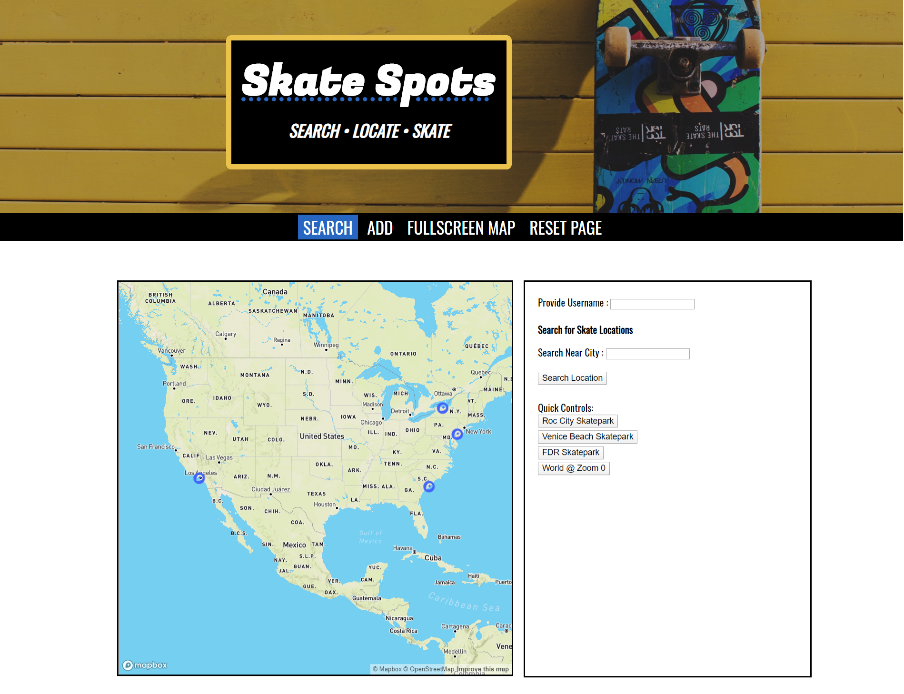
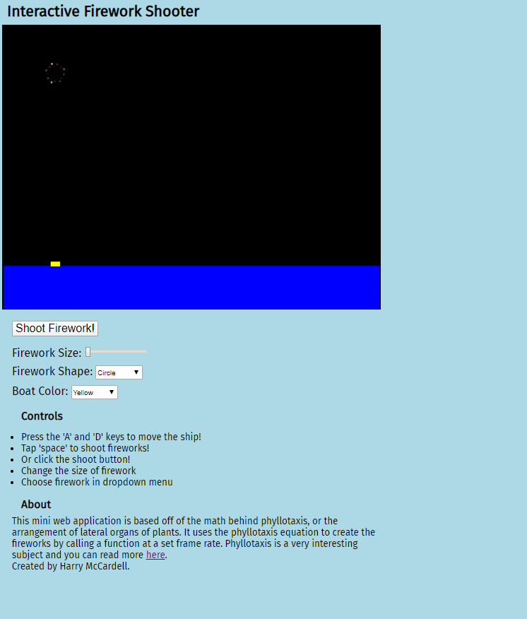
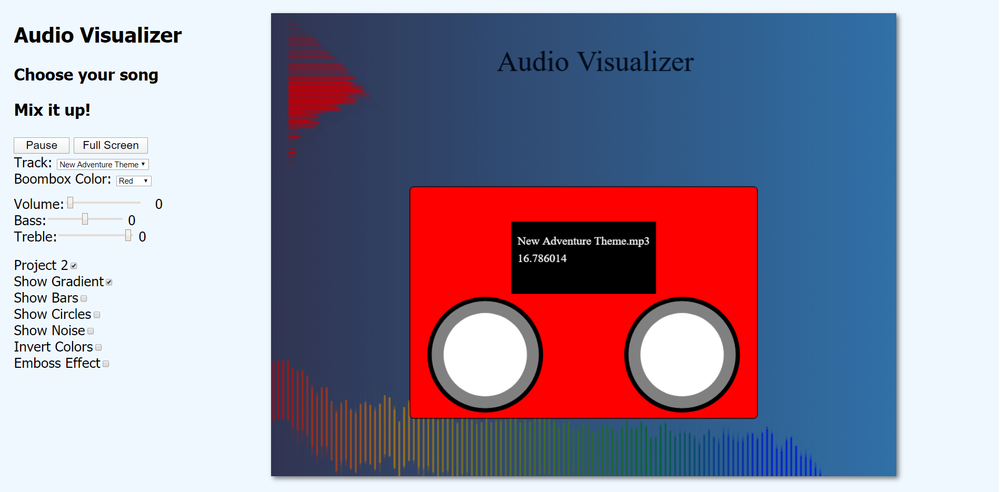

# web
Assignments, projects, coursework from IGME 330 and 230 web courses
 - programs created with Javascript, ECMAScript 6, APIs, HTML5, CSS3, PHP
 
### Skate Spots - *current project* - IGME 330 project 3

   - https://people.rit.edu/hhm7826/330/project3/
   - Dual API App
   - Firebase Realtime Database
   - Mapbox.gl

### Interactive Fireworker Shooter App - IGME 330 - project 1

   - https://people.rit.edu/hhm7826/330/project1/
   - Canvas API
   
### Audio Visualizer App - IGME 330 project 2 

   - https://people.rit.edu/hhm7826/330/project2/
   - Web Audio API
   - Canvas API

